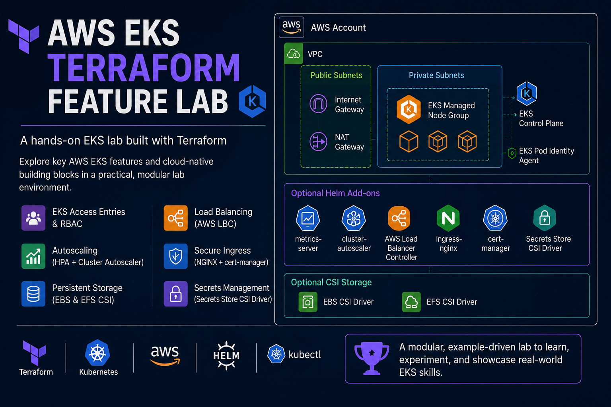

# AWS EKS Terraform Feature Lab

This project is a EKS lab built with Terraform.
The goal is not to be a production platform module. The goal is to show how the main EKS building blocks fit together: networking, managed nodes, EKS access entries, Pod Identity, autoscaling, ingress, persistent storage, and Secrets Manager integration.

## Architecture



```text
AWS account
└── VPC
    ├── Public subnets
    │   ├── Internet Gateway
    │   └── NAT Gateway
    ├── Private subnets
    │   └── EKS managed node group
    ├── EKS control plane
    ├── EKS Pod Identity Agent
    ├── Optional Helm add-ons
    │   ├── metrics-server
    │   ├── cluster-autoscaler
    │   ├── AWS Load Balancer Controller
    │   ├── ingress-nginx
    │   ├── cert-manager
    │   └── Secrets Store CSI Driver
    └── Optional CSI storage
        ├── EBS CSI Driver
        └── EFS CSI Driver
```

More detail is in [docs/architecture.md](docs/architecture.md).

## Repository Structure

```text
bootstrap/backend/       # One-time S3 and DynamoDB remote state bootstrap
environments/dev/        # Main Terraform root module
modules/                 # Reusable feature modules
examples/                # Kubernetes YAML workloads for testing features
values/                  # Helm values and IAM policy JSON
docs/                    # Architecture, feature notes, troubleshooting
notes/                   # Original learning notes
```

## Feature Matrix

| Feature | Terraform module | Kubernetes example |
| --- | --- | --- |
| VPC networking | `modules/vpc` | N/A |
| EKS cluster and managed node group | `modules/eks` | N/A |
| EKS access entries and RBAC | `modules/user-access` | `examples/rbac-*` |
| Metrics Server | `modules/metrics-server` | `examples/hpa` |
| Horizontal Pod Autoscaler | Terraform add-on + YAML | `examples/hpa` |
| Cluster Autoscaler | `modules/cluster-autoscaler` | `examples/cluster-autoscaler` |
| AWS Load Balancer Controller | `modules/aws-load-balancer-controller` | `examples/alb-*` |
| NGINX Ingress Controller | `modules/nginx-ingress` | `examples/nginx-ingress` |
| cert-manager | `modules/cert-manager` | `examples/nginx-ingress-cert-manager` |
| EBS CSI Driver | `modules/ebs-csi` | `examples/ebs-statefulset` |
| EFS CSI Driver | `modules/efs-csi` | `examples/efs-statefulset` |
| Secrets Store CSI Driver | `modules/secrets-store-csi` | `examples/secrets-store-csi` |

See [docs/features.md](docs/features.md) for notes on each feature.

## Prerequisites

- AWS CLI configured with permissions to create VPC, EKS, IAM, EFS, EBS, S3, DynamoDB, and load balancer resources.
- Terraform `>= 1.5`.
- `kubectl`.
- Helm.
- An AWS account with enough service quota for EKS, EC2, NAT Gateway, and load balancers.

## Cost Warning

This lab creates paid AWS resources, including an EKS cluster, EC2 nodes, NAT Gateway, EFS, and load balancers. Delete Kubernetes examples before destroying Terraform so AWS-managed load balancer resources can clean up properly.

## 1. Bootstrap Remote State

Run this once before using the S3 backend in `environments/dev`.
The backend stack uses the same default region as the lab: `eu-west-2`.

```bash
cd bootstrap/backend
terraform init
terraform apply
```

## 2. Deploy The EKS Lab

The default deployment creates only:

```text
vpc -> eks
```

```bash
cd environments/dev
terraform init
terraform plan
terraform apply
```

Configure `kubectl`:

```bash
aws eks update-kubeconfig --region eu-west-2 --name dev-eks-cluster
kubectl get nodes
```

Optional add-ons are commented out in `environments/dev/main.tf`. Uncomment the module block for the feature you want to test, and uncomment the Helm/Kubernetes provider configuration in `environments/dev/providers.tf` when that feature needs it.

```text
HPA: uncomment metrics_server
Cluster Autoscaler: uncomment cluster_autoscaler
ALB examples: uncomment aws_load_balancer_controller
NGINX ingress: uncomment aws_load_balancer_controller + nginx_ingress
NGINX TLS: uncomment aws_load_balancer_controller + nginx_ingress + cert_manager
EBS StatefulSet: uncomment ebs_csi
EFS StatefulSet: uncomment efs_csi
Secrets Store CSI: uncomment secrets_store_csi
```

## 3. Test Examples

Apply examples one folder at a time:

```bash
kubectl apply -f examples/rbac-developer
kubectl apply -f examples/rbac-admin
kubectl apply -f examples/hpa
kubectl apply -f examples/cluster-autoscaler
kubectl apply -f examples/alb-service
kubectl apply -f examples/alb-ingress
kubectl apply -f examples/nginx-ingress
kubectl apply -f examples/ebs-statefulset
kubectl apply -f examples/efs-statefulset
kubectl apply -f examples/secrets-store-csi
```

Important paths:

```text
HPA: vpc -> eks -> metrics-server -> examples/hpa
Cluster Autoscaler: vpc -> eks -> cluster-autoscaler -> examples/cluster-autoscaler
```

`metrics-server` is optional in Terraform, but HPA needs it before the HPA example will work. Cluster Autoscaler does not require metrics-server directly, but both are useful together in the lab.

## 4. Useful Checks

```bash
kubectl get pods -A
kubectl get hpa -A
kubectl get ingress -A
kubectl get svc -A
helm list -A
aws eks describe-cluster --region eu-west-2 --name dev-eks-cluster
```

## 5. Cleanup

Delete example workloads first:

```bash
kubectl delete -f examples/secrets-store-csi --ignore-not-found
kubectl delete -f examples/efs-statefulset --ignore-not-found
kubectl delete -f examples/ebs-statefulset --ignore-not-found
kubectl delete -f examples/nginx-ingress-cert-manager --ignore-not-found
kubectl delete -f examples/nginx-ingress --ignore-not-found
kubectl delete -f examples/alb-ingress-tls --ignore-not-found
kubectl delete -f examples/alb-ingress --ignore-not-found
kubectl delete -f examples/alb-service --ignore-not-found
kubectl delete -f examples/cluster-autoscaler --ignore-not-found
kubectl delete -f examples/hpa --ignore-not-found
kubectl delete -f examples/rbac-admin --ignore-not-found
kubectl delete -f examples/rbac-developer --ignore-not-found
```

Then destroy Terraform:

```bash
cd environments/dev
terraform destroy
```

Troubleshooting notes are in [docs/troubleshooting.md](docs/troubleshooting.md).
